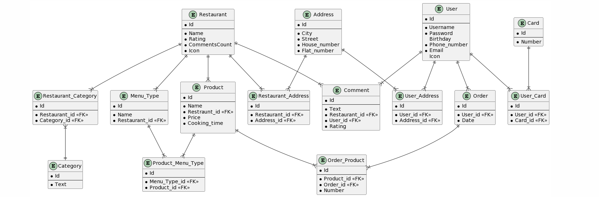

## user 

Таблица Пользователей и его персональные данные ( ник, почта, телефон и тд)

Связанные таблицы: card, user_address, comment

```
user:
{id} -> {password, birthday, icon}
{username} -> {password, birthday, icon}
{phone_number} -> {password, birthday, icon}
{email} -> {password, birthday, icon}

```


## restaurant 
Таблица Ресторанов и его данные ( название, рейтинг, и тд)

Связанные таблицы: restaurant_category, restaurant_address, comment, menu_type, product

```
restaurant:
{id}-> {name, rating, comments_count, category, icon}
{name}->{rating, comments_count, category, icon}

```


## category 
Tаблица категорий ресторанов с текстовым названием категории

Связанные таблицы: restaurant_category

```
category:
{id}->{text}

```


## restaurant_category 
Таблица-связка между ресторанами(restaurant) и категориями (category)

```
restaurant_category:
{id}->{restaurant_id, category_id}

```


## menu_type 
Раздел меню в ресторане
Связанные таблицы: product_menu_type

```
menu_type:
{id}->{name, restaurant_id}

```


## product 
Продукт в ресторане ( с его ценой, временем приготовления и тд)
Связанные таблицы: product_menu_type, order_product

```
product:
{id}->{ price, cooking_time}
{name, restraunt_id}->{price, cooking_time}

```


## product_menu_type 
Таблица-связка между продуктами (product) и разделами меню (menu_type)

```
product_menu_type:
{id}->{menu_type_id, product_id}

```


## order 
Таблица заказов
Связанные таблицы: order_product

```
order:
{id}->{user_id, date}

```


## order_product 
Таблица-связка между продуктами (product) и заказами (order)

```
order_product:
{id}->{product_id, order_id}

```


## comment 
Таблица комментариев пользователей к ресторанам

```
comment:
{id}->{text, restaurant_id, user_id, rating}

```


## card 
Таблица карт пользователей

```
card:
{id}->{number, user_id}

```


## address 
Таблица адресов
Связанные таблицы: restaurant_address, user_address

```
address:
{id}->{city, street, house_number, flat_number}

```


## restaurant_address 
Таблица адресов ресторанов (таблица-связка между адресами и ресторанами)

```
restaurant_address:
{id}->{restaurant_id, address_id}

```


## user_address 
Таблица адресов ресторанов (таблица-связка между адресами и ресторанами)

```
user_address:
{id}->{user_id, address_id}

```


### Cсылка на ER-диаграммы: 
https://www.plantuml.com/plantuml/uml/bLJHhjem37tFL-HvKl_WwkfktQw6fZ74uBdAY0NLscHA76qLvT_NXWQPOe9ugdEEVOuZEttpg1o6jX5WiCPERZquUHHIVf0BFNoA8iOZR5GByR1Itl-rRgG_rGuFMdLd_60DL2Qqly15u4khwcQ85Zjhn4c8PBA6mJOuPP2nMYQRjSBQx6DOshO5WxwqmU28P2IhKY7ihUiORP9LQ_doylxjzJKIgOR0H3oZk85_I5E_WmdLfli3sPinRL2HbRCwxB3AYLsusKrIRKxuKMzE1OCtklKEfc7OtyDWAgo74gh-m-cxopDJ-wmGRaehlZtsLX6DLJDi6TUFQAVbkJUyp5umhQUrf0OVjNRWFMDG3dGCVg83E7jzjS5VlPBtHc4wynlD6sGRdqhODOYtoeX6-WcvKZdDoAH9NDlooPpdc3ap93-ElY-A_iYzUy5WyZIczpAT6QNBWnANA54txr5CI4fud76ru2AUU6hhPmn5qYupxITccbI2wQXd7BDXHFUf9DeywnodJeaHeEa4VGEZGzly1m00

