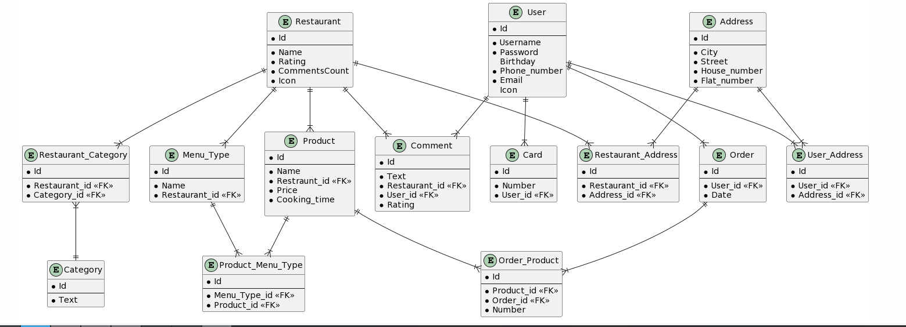

user - Таблица Пользователей и его персональные данные ( ник, почта, телефон и тд)
Связанные таблицы: card, user_address, comment
user:
{id} -> {password, birthday, icon}
{username} -> {password, birthday, icon}
{phone_number} -> {password, birthday, icon}
{email} -> {password, birthday, icon}

restaurant - Таблица Ресторанов и его данные ( название, рейтинг, и тд)
Связанные таблицы: restaurant_category, restaurant_address, comment, menu_type, product
restaurant:
{id}-> {name, rating, comments_count, category, icon}
{name}->{rating, comments_count, category, icon}

category - Tаблица категорий ресторанов с текстовым названием категории
Связанные таблицы: restaurant_category
category:
{id}->{text}

restaurant_category - Таблица-связка между ресторанами(restaurant) и категориями (category)
restaurant_category:
{id}->{restaurant_id, category_id}

menu_type - Раздел меню в ресторане
Связанные таблицы: product_menu_type
menu_type:
{id}->{name, restaurant_id}

product - Продукт в ресторане ( с его ценой, временем приготовления и тд)
Связанные таблицы: product_menu_type, order_product
product:
{id}->{ price, cooking_time}
{name, restraunt_id}->{price, cooking_time}

product_menu_type - Таблица-связка между продуктами (product) и разделами меню (menu_type)
product_menu_type:
{id}->{menu_type_id, product_id}

order - Таблица заказов
Связанные таблицы: order_product
order:
{id}->{user_id, date}

order_product - Таблица-связка между продуктами (product) и заказами (order)
order_product:
{id}->{product_id, order_id}

Comment - Таблица комментариев пользователей к ресторанам
Comment:
{id}->{text, restaurant_id, user_id, rating}

card - Таблица карт пользователей
card:
{id}->{number, user_id}

address - Таблица адресов
Связанные таблицы: restaurant_address, user_address
address:
{id}->{city, street, house_number, flat_number}

restaurant_address - Таблица адресов ресторанов (таблица-связка между адресами и ресторанами)
restaurant_address:
{id}->{restaurant_id, address_id}

user_address - Таблица адресов ресторанов (таблица-связка между адресами и ресторанами)
user_address:
{id}->{user_id, address_id}

Cсылка на ER-диаграммы: https://www.plantuml.com/plantuml/uml/fPJFxjem3CVlUOgS9_KD46BhXeQcCSJWN6N4WceqcH97MqLvzxN1C08cCFrEk5__-IJOpiIZSXYQlG23DRPoxS79Wv3odPpf_gSeeZt8HZKGFnRA-z_M3UuFjSETLkr9tra3bGdD3t1H-DIeUjzRiuqruYWcOFI0keCkeLU2KmOPzFoCNIgipJQQfMsQFjUNDXYCokk8gbG8M-jQXdKLLMiv6as_ZCSd8ELSoHbOXh22FvXB_GecLAls5sJ_2UwOcQ8BPtNOO9KhVl6bDwVS_mCzExjJmU0Tfzu0DTV-x1jTOTsdv6ZVd7uuh3VLFog4fwMgnySdJrgLib9j7iS_nwBXVJGSkJbahaPhaGE-rzg1zmomxDtH-8uEuCJ-R8DFjdYwLqZVBsuO3ynUZ5BuCUCUgGmakjzGlbHECsMfimo1gtNrfdLTKNG7xWaIZ2QFGtWdcHYgz6zNnSKYr_sg2rBE0KyZqbqGyOjthVsD9r5ep9dZaoUDLauBwX9fIPjlVCoqfQ3NWvBRS6JgxLy0

